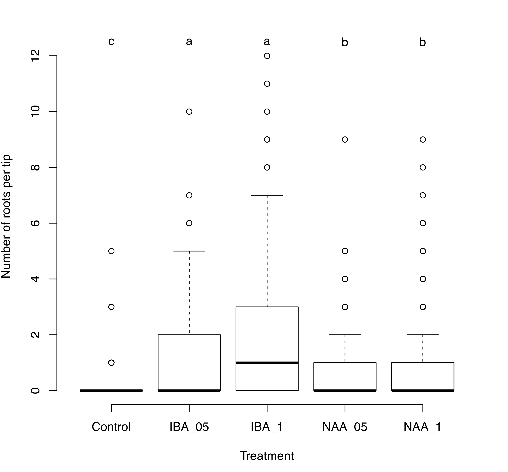
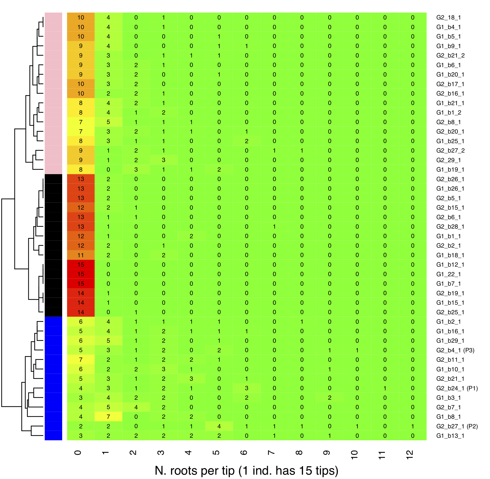
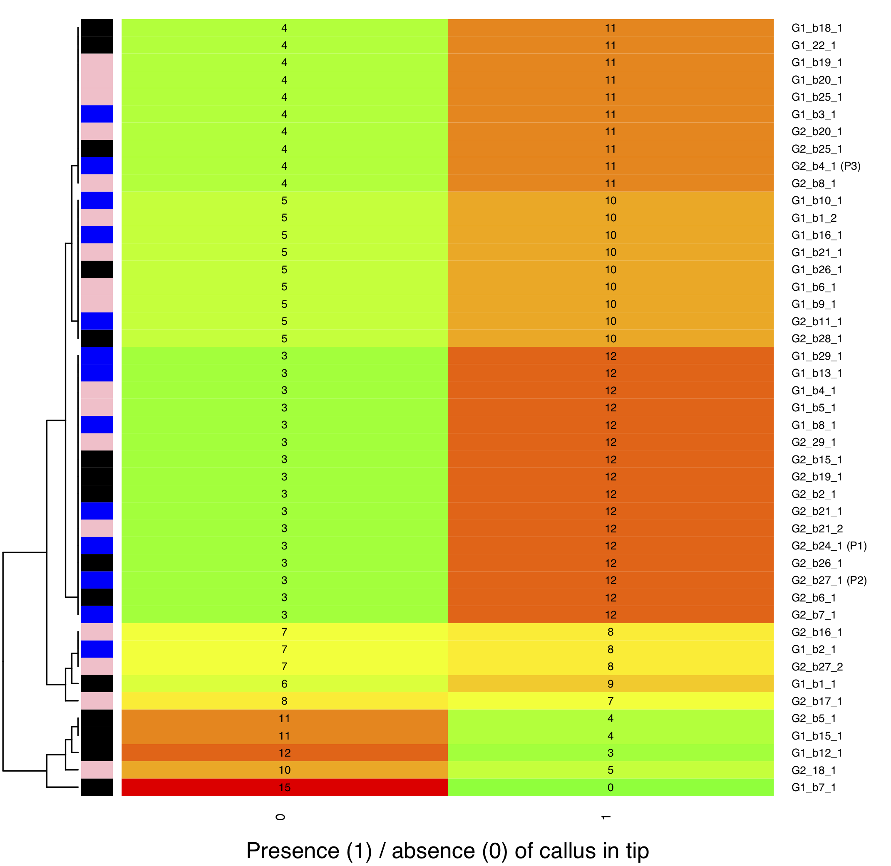

--- 
title: 'Development of an *in vitro* method of propagation using growth regulators for Basin Big sagebrush (*Artemisia tridentata* subsp. *tridentata*: 2n=2x=18) to support genome sequencing and GxE research'
author: "Peggy Martinez, Rachael Barron, Marcelo Serpe, Sven Buerki"
date: "Boise State University (`r Sys.Date()`)"
output:
  bookdown::html_document2: 
    toc: TRUE
    toc_float: true
link-citations: yes
fontsize: 12pt
bibliography: packages.bib
---

```{r packages, echo=FALSE, warning=FALSE, include=FALSE}
library(knitr)
library(rmarkdown)
library(bookdown)
library(knitcitations)
library(formatR)
library(devtools)
library(gplots)
library(RColorBrewer)
library(grDevices)

#Generate BibTex citation file for all R packages used to produce report
knitr::write_bib(.packages(), file = 'packages.bib')
```


```{r setup, include=FALSE, cache=FALSE, message = FALSE}
#Load packages
library(knitr)
library(rmarkdown)
# Chunk options: see http://yihui.name/knitr/options/ ###

## Text results
opts_chunk$set(echo = TRUE, warning = TRUE, message = TRUE, include = TRUE)

## Code decoration
opts_chunk$set(tidy = TRUE, tidy.opts = list(blank = FALSE, width.cutoff = 60), highlight = TRUE)

## Caching code
opts_chunk$set(cache = 2, cache.path = "cache/")

## Plots
opts_chunk$set(fig.path = "Figures_MS/", dev=c('pdf', 'png'), dpi = 300)

## Locate figures as close as possible to requested position (=code)
#opts_chunk$set(fig.pos = "H")
```

# *plants* authors guidelines

This manuscript will be submitted to the *plants* journal.

https://www.mdpi.com/journal/plants/instructions#submission

Download word template and populate it according to guidelines.


# Reproducible workflow: integrating code, data, methods and key outcomes

This document is associated to Martinez et al. and provides the reproducible workflow integrating code, data, methods and key outcomes associated to this study. 

Citations of all `R` packages to conduct this research and produce this document are provided in [Appendix 1]. Version information about `R`, the operating system (OS) and attached or `R` loaded packages are available in [Appendix 2]. The raw data related to sampling and scoring of rooting and presence of calli in tips are freely available at this [path](https://drive.google.com/drive/folders/12P0LYxoFwpe_eQXhaL9iXzk9xE6K22DV?usp=sharing). These two appendices together with the data and R code provided below should allow reproducibility of this study.

# Abstract

This study aims at developing an *in vitro* method of propagation using phytohormones for Basin Big sagebrush (*Artemisia tridentata* subsp. *tridentata*) to support genome sequencing and GxE research. Our sampling is based on seedlings generated from two diploid mother plants (2n=2x=18) originating from contrasting environments reflecting the presence (population IDT3) or absence (population UTT2) of summer drought. These two contrasting climates are providing hypotheses for genotypes, with individuals from IDT3 representing a drought-tolerant genotype (G1), whereas those from UTT2 representing a drought-sensitive genotype (G2). The effect of the growth regulators IBA and NAA on rooting of shoot tips of sagebrush seedlings were compared to a control treatment based on two concentrations per growth regulator (1 and 0.5 mg/l) resulting into five treatments. A total of 45 individuals (23 G1 and 22 G2) were included in the analysis and 15 shoot tips per individual were randomly allocated to treatments with 3 replicates. Finally, treatments were applied into five blocks including nine randomly selected individuals. The presence and number of roots per shoot tip were quantified after 15 days and used to perform comparative statistical and clustering analyses. Results strongly suggested that sagebrush is a highly out-bred species as shown by the high individual rooting response, which was not be attributed to either mother plants (hypothesized genotypes) or blocks. The statistical analyses identified `G2_b27_1` and `G2_b24_1` as candidates for establishing lines, whereas three clusters were recognized based on rooting performances: black (n=15): limited to no rooting; pink (n=17): some rooting; blue (n=13): high rooting. The blue cluster included a mixture of G1 (n=7) and G2 (n=6) individuals as well as the two top performers identified by the statistical analyses. To better reflect genotype variation and local adaptations into our clone lines, we are therefore recommending including individuals of G1 belonging to the blue cluster in our next phase of experiments.  The IBA growth regulator significantly outperformed the other treatments, however concentration seemed not to impact rooting. Overall the rooting response for individuals undergoing IBA treatment was at 60% for all individuals, but it significantly increased to 87.18% for individuals in the blue cluster. Statistical analyses have also revealed that calli production are promoted by growth regulators (response of 2.96% in control vs. >75% with growth regulators), but it was not inhibiting rooting since individual in the blue cluster treated with IBA had a response of 87.18%. Further research on processes initiating calli production is required since our analyses suggested that this trait is individual specific. Three clusters were identified based on calli production, but those did not matching with the rooting clusters therefore suggesting that calli production does not predict rooting of shoot tips in sagebrush.

# Scientific questions and associated methodology 

Within the purview of this study, which aims at developing an *in vitro* method of propagation using growth regulators for Basin Big sagebrush (*Artemisia tridentata* subsp. *tridentata*: 2n=2x=18) to support genome sequencing and GxE research we are investigating these specific questions:

- **Q1:** Are growth regulators (here IBA and NAA) significantly increasing rooting of sagebrush shoot tips?
  + Test whether there is a significant treatment effect in explaining rooting data using statistical (ANOVAs followed by Tukey tests) and clustering analyses.
- **Q2:** Are some individuals more efficient at rooting independently of treatment? If yes, those would be candidates to establish sagebrush lines of known genomes?
  + Test whether there is a significant individual effect in explaining rooting data using statistical (ANOVAs followed by Tukey tests) and clustering analyses. Best performers will be defined based on the statistical and clustering analyses. To qualify as a top performer, the individual will have to significantly outperform at least 20% of the pool of individuals (based on Tukey tests). In addition, the clustering analysis will reveal clusters of individuals sorted based on their ability to rooting independently of treatment. Results of those latter analyses will be compared and used as input for Q3.
- **Q3:** Are treatments identified in **Q1** still valid for top performers?
    + Test whether treatments demonstrated to significantly increase rooting in Q1 are still applying to top performers (= candidates for sagebrush lines). This is done by applying the same methodology than in Q1 to a dataset including only the top performers (identified in Q2). 
- **Q4:** Can we successfully transfer rooted shoot tips into tissue culture media and maintain seedlings *in vitro*? We are scoring survival and measuring heights of seedlings at 3 and 5 weeks.

During the experiment, calli have developed on shoot tips in the absence of growth-promoting hormones auxin and cytokinin, which was an unexpected phenotype based on preliminary experiments. Such phenotype is hypothesized to be related to endogenous auxin and cytokinin production due to the age of our sagebrush plants, which are interacting with added growth regulators (here IBA and NAA). Due to COVID, sagebrush plants had to stay in the culture chamber longer than in our previous experiment (60 days vs. 180 days). We can not test for the impact of endogenous auxin and cytokinin (since we did not measure those), but are able to test whether IBA and NAA promoted calli production. This was done by using the same statistical and clustering analyses as in Q1. Finally, clusters inferred from calli data are compared to those obtained from rooting data to ascertain whether calli production impacts rooting. 

# Material and Methods

## Comparative analyses on tissue culture data

Tissue culture data were analyzed using the analysis of variance (ANOVA) in three-way fashion to investigate treatment, genotype, block and interaction effects using rooting (binary and number of roots per shoot tip) and calli (binary) data as response variables. All ANOVAs were performed in base R (R Core Team, 2020) with the *aov* function and a significance level defined as p-value ≤ 0.01.  Variables deemed significant were subsequently analyzed using a *post-hoc* Tukey’s test with the *TukeyHSD* function in base R (R Core Team, 2020) to identify significant pairwise comparisons using adjusted p-value ≤ 0.01. Percentage of responses, means and standard deviations were calculated in R using base functions. Clustering analyses coupled with heatmaps were inferred on rooting (number of roots per shoot tip) and calli data to sort individuals based on their rooting and calli productions independently of treatments. These analyses were performed in R (R Core Team, 2020) with the *heatmap.2* implemented in the *gplots* package. To ascertain whether clusters obtained based on rooting data were congruent with those from calli data, clusters from the former were mapped onto the latter. The data, code, citations to R packages as well as versions of all packages are available in supplementary material.       

# Code and analyses to import, tidy data and perform preliminary analyses

## Importing and tyding raw data

The objective of this section is to merge data on rooting and calli stored in spreadsheets (in `csv` format). Each spreadsheet corresponds to a block and this information will be collated into one `data.frame` for analyses. 

The final dataset (`MERGE` object) contains the following columns (see Table \@ref(tab:tidy) for more details on sampling):

- Block
- Treatment
- Replicate
- Genotype
- Individual (there will be two column, with one including Genotype information)
- Callus
- Root

```{r tidy1, echo=TRUE, eval=TRUE}
###~~
#List all csv files (raw data from blocks)
###~~~
csv <- list.files(pattern='block.csv')

#Print names of csv files
print(csv)

#Rm processed files
toRm <- grep("Processed_", csv)
if(length(toRm) > 0){
  csv <- csv[-toRm]
}

###~~~
#Execute loop to process all files and merge them (see below)
###~~~
# Empty object that will contain all processed data
MERGE <- NULL
for(i in 1:length(csv)){
  ###
  #Read in sv file
  mat <- read.csv(csv[i])
  
  ###~~~
  #Create final matrix
  ###~~~
  
  #List of individuals
  indcsv <- LETTERS[seq( from = 1, to = 9 )]
  
  #Empty matrix
  FINALmat <- data.frame(matrix(ncol=7, nrow = nrow(mat)*length(indcsv)))
  colnames(FINALmat) <- c("Block","Treatment", "Replicate", "Genotype", "Individual", "Callus", "Root")
  
  ###~~~
  #Start populating FINALmat 
  ###~~~
  # Add Block, Treatment and Replicates
  #Get data for block, treatment (and replicates)
  blockTreatRep <- rep(as.vector(mat$X), 9)
  FINALmat$Block <- sapply(strsplit(blockTreatRep, split='_'), "[", 1)
  FINALmat$Treatment <- paste(sapply(strsplit(blockTreatRep, split='_'), "[", 2), sapply(strsplit(blockTreatRep, split='_'), "[", 3), sep='_')
  FINALmat$Replicate <- sapply(strsplit(blockTreatRep, split='_'), "[", 4)
  
  #Deal with Controls
  contr <- grep("Control_", FINALmat$Treatment)
  FINALmat$Replicate[contr] <- sapply(strsplit(FINALmat$Treatment[contr], split="_"), "[",2)
  FINALmat$Treatment[contr] <- sapply(strsplit(FINALmat$Treatment[contr], split="_"), "[",1)
  
  ###~~~
  # Fetch individual data
  ###~~~
  
  #Where are ind in mat?
  indcol <- match(indcsv, colnames(mat))
  
  #Fetch raw data for each individual in block
  OUT <- NULL
  for(j in 1:length(indcol)){
    #Extract info for each individual
    tmp <- mat[,indcol[j]:(indcol[j]+2)]
    colnames(tmp) <- c("Ind", "Callus", "Root")
    OUT <- rbind(OUT, tmp)
  }
  
  ###~~~
  #Add OUT to FINALmat
  ###~~~
  
  #Genotypes
  FINALmat$Genotype <- sapply(strsplit(as.vector(OUT$Ind), split='_'), "[", 1)
  #Ind
  FINALmat$Individual <- paste(sapply(strsplit(as.vector(OUT$Ind), split='_'), "[", 2), sapply(strsplit(as.vector(OUT$Ind), split='_'), "[", 3), sep='_')
  #Callus
  FINALmat$Callus <- OUT$Callus
  #Root
  FINALmat$Root <- OUT$Root
  
  ###~~~
  #Save FINALmat
  ###~~~
  write.csv(FINALmat, file=paste0("Processed_data/Processed_", csv[i]), row.names = F, quote = F)
  
  ###~~~
  #MERGE all csv
  ###~~~
  MERGE <- rbind(MERGE, FINALmat)
  
}

#Finalize preping the data
MERGE <- data.frame(MERGE)

MERGE$IndGeno <- paste(MERGE$Genotype, MERGE$Individual, sep="_")

#Create a binary for Root
MERGE$RootBin <- MERGE$Root
MERGE$RootBin[MERGE$RootBin > 0] <- 1

###~~~
#Save MERGED files with all blocks
###~~~
write.csv(MERGE, file=paste0("Processed_data/Processed_", "blocks_rooting.csv"), row.names = F, quote = F)

#Return head of MERGE (see Appendix for more details)
head(MERGE)
```

## Statistics on sampling 

Table \@ref(tab:statssampling) table shows that our sampling includes 45 individuals distributed into two genotypes (which were evenly sampled). For each individual, 15 tips were produced and included into five treatments with three replicates (including 3 shoot tips/ind./treatment). Every block was composed of nine individual randomly assigned to blocks. Please see code below for more details on methodology.

```{r statssampling, echo=TRUE, eval=TRUE}
#Create and populate table to summarize sampling (Table 1)
samp_mat <- matrix(ncol=9, nrow=1)
colnames(samp_mat) <- c("N. block", "N. treatments", "Treatments", "N. replicates", "N. genotypes", 
                        "N. individuals", "N. ind. per genotype", "Ind. G1", "Ind. G2")

#N block
samp_mat[,1] <- length(unique(MERGE$Block))
#N treat
samp_mat[,2] <- length(unique(MERGE$Treatment))
#Treat ID
samp_mat[,3] <- paste(sort(unique(MERGE$Treatment)), collapse = ", ")
#N replicates
samp_mat[,4] <- length(unique(MERGE$Replicate))
#N genotypes
samp_mat[,5] <- length(unique(MERGE$Genotype))
#N ind
samp_mat[,6] <- length(unique(MERGE$IndGeno))
#N ind per genotype
samp_mat[,7] <- paste(paste("G1:", list(table(MERGE$Genotype)/15)[[1]][1]), paste("G2:", list(table(MERGE$Genotype)/15)[[1]][2]), sep=', ')
#List ind G1
samp_mat[,8] <- paste(sort(unique(subset(MERGE$IndGeno, MERGE$Genotype == "G1"))), collapse=', ')
#List ind G2
samp_mat[,9] <- paste(sort(unique(subset(MERGE$IndGeno, MERGE$Genotype == "G2"))), collapse=', ')

#Write table
write.csv(samp_mat, file="Table_1_sampling_summary.csv", row.names = F)

#Plot table
knitr::kable(samp_mat, caption = "Summary of sampling at the basis of sagebrush rooting experiment.")
```

## Preliminary analyses

Preliminary data summarizing results of our experiments are provided here to assess the effect of growth regulators on *in vitro* rooting of *Artemisia tridentata*. During the course of the experiment, calli developed on a large proportion of shoot tips, which was unexpected based on preliminary data. We are therefore summarizing these data here by treatment and will devote a portion of the analyses to investigate whether callus development was associated to treatments and whether those inhibited or promoted rooting (see analyses associated to Q4 below).

### Effect of growth regulators on *in vitro* rooting of *Artemisia tridentata*

The effect of growth regulators is provided in Table \@ref(tab:growthbyregulator) and compared to the control. These data show a very high level of variation in rooting (see `Av. No. roots`). We are hypothesizing that this trend is caused by an individual effect. To test this hypothesis we will conduct ANOVA analyses and use a clustering analysis to sort individuals based on their rooting abilities. Finally, the effect of growth regulators on *in vitro* rooting will be compared within each cluster.  

```{r growthbyregulator, echo=T, eval=T}
#Matrix summarizing effect of growth regulators on rooting
RootingStatbyTreat <- matrix(ncol=4, nrow=5)
colnames(RootingStatbyTreat) <- c("Growth regulator", "Concentration (mg/l)", "Response (%)", "Av. No. of roots")
rownames(RootingStatbyTreat) <- sort(unique(MERGE$Treatment))

#Convert to dataframe
RootingStatbyTreat <- as.data.frame(RootingStatbyTreat)

#Populate matrix
RootingStatbyTreat$`Growth regulator` <- sapply(strsplit(rownames(RootingStatbyTreat), split="_"),"[[",1)
RootingStatbyTreat$`Concentration (mg/l)` <- c("-", sapply(strsplit(rownames(RootingStatbyTreat)[2:nrow(RootingStatbyTreat)], split="_"),"[[",2))

#Infer Response and mean no roots
for(i in 1:nrow(RootingStatbyTreat)){
  foo <- subset(MERGE, MERGE$Treatment == rownames(RootingStatbyTreat)[i])
  RootingStatbyTreat$`Response (%)`[i] <- round(100*(mean(foo$RootBin)),2)
  RootingStatbyTreat$`Av. No. of roots`[i] <- paste(round(mean(foo$Root),2), "+/-", round(sd(foo$Root),2), sep=" ")
}


#Plot table
knitr::kable(RootingStatbyTreat, row.names=F, caption = "Effect of growth regulator on in vitro rooting of Artemisia tridentata. Response: mean of the three replicates; Av. No. of roots: mean +/- standard deviation.")
```

### Effect of growth regulators on *in vitro* callus development in *Artemisia tridentata*

The effect of growth regulators is provided in Table \@ref(tab:growthbyregulatorcallus) and compared to the control. These data show contrasting calli development between the control and treatments including growth hormones. Control shoot tips did not develop calli, whereas responses for those undergoing treatments were very high (>70%; Table \@ref(tab:growthbyregulatorcallus)).

```{r growthbyregulatorcallus, echo=T, eval=T}
#Matrix summarizing effect of growth regulators on rooting
CallusStatbyTreat <- matrix(ncol=3, nrow=5)
colnames(CallusStatbyTreat) <- c("Growth regulator", "Concentration (mg/l)", "Response (%)")
rownames(CallusStatbyTreat) <- sort(unique(MERGE$Treatment))

#Convert to dataframe
CallusStatbyTreat <- as.data.frame(CallusStatbyTreat)

#Populate matrix
CallusStatbyTreat$`Growth regulator` <- sapply(strsplit(rownames(CallusStatbyTreat), split="_"),"[[",1)
CallusStatbyTreat$`Concentration (mg/l)` <- c("-", sapply(strsplit(rownames(CallusStatbyTreat)[2:nrow(CallusStatbyTreat)], split="_"),"[[",2))

#Infer Response and mean no roots
for(i in 1:nrow(CallusStatbyTreat)){
  foo <- subset(MERGE, MERGE$Treatment == rownames(CallusStatbyTreat)[i])
  CallusStatbyTreat$`Response (%)`[i] <- round(100*mean(foo$Callus),2)
}


#Plot table
knitr::kable(CallusStatbyTreat, row.names=F, caption = "Effect of growth regulator on in vitro callus development in Artemisia tridentata. Response: mean of the three replicates.")
```


# Code and analyses associated to Q1

To answer this question, we are conducting ANOVA analyses followed by Tukey tests on significant on root data (more specifically the number of roots produced by tip after 15 days) using a p-value of 0.01. These analyses were also replicated on binary rooting data (presence/absence) and are available in [Appendix 4]. These latter analyses are highly congruent with the number of roots per shoot tips. 

## ANOVAs with model based on number of roots per shoot tip

Our overall model is `root ~ treatment` But we are also testing if there is a `Block`, `Genotype` and `IndGeno` (= individual) effect in rooting. This leads to this model:

```
aov(Root ~ Treatment * Block * Genotype * Individual)
significance threshold: 0.01 
```

```{r ANOVAroot, echo=T, eval=T}
#Defining model and runing analyses
anovaOUT<- aov(Root ~ Treatment * Block * Genotype * IndGeno, data = MERGE)

#Summary
summary(anovaOUT)

#as.data.frame.matrix(x[[1]][1:5])

#Save analysis
saveRDS(anovaOUT,"rds/anova.rds")
```

In our model, significant variables (`**` or `***`) are:

- Treatment (`***`)
- Individual (here represented by `IndGeno`) (`***`)
- Treatment:Block (`***`)
- Treatment:Individual (`**`) 

We are hypothesizing that the latter two variables result from to the high individual effect since individuals were randomly assigned to blocks (see Q2 for more details). 

## Tukey tests on significant variables

Perform the Tukey test to identify treatment(s) best performing for initiating roots.

```{r tukeyroot, echo=T, eval=T}
#Tukey tests on significant variables
significant_vars <- c("Treatment", "IndGeno", "Treatment:IndGeno", "Treatment:Block")
anovaOUT_tukey <- TukeyHSD(anovaOUT, significant_vars)

#Save analysis
saveRDS(anovaOUT_tukey,"rds/anova_tukey.rds")

#What treatment(s) are significantly increasing rooting? (**: 0.01)
treatcomp <- anovaOUT_tukey$Treatment[which(as.numeric(anovaOUT_tukey$Treatment[,4]) <= 0.01),]

#Plot table
knitr::kable(treatcomp, caption = "Results of Tukey tests comparing treatments (with pval: <=0.01).")
```

Table \@ref(tab:tukeyroot) allows ranking treatments as follows (from worst to best):

 - (c) Control (outperformed by all treatments) (`***`)
 - (b) NAA_1 and NAA_05
 - (a) IBA_1, IBA_05 (although IBA_1 outperforms IBA_05 with a pval <= 0.05)

## Boxplot

To support further visual comparison of rooting by treatment, a boxplot was inferred based on the merged dataset (`MERGE`). Figure \@ref(fig:boxplot1) supports ranking from the Tukey analysis (Table \@ref(tab:tukeyroot) and would suggest that `IBA_1` is the most efficient treatment to initiate rooting in sagebrush with a median value of 1 root per tip (whereas other treatments have their median at 0).

```{r boxplot, echo=T, eval=F}
#Boxplot comparing rooting per treatment
boxplot(MERGE$Root ~ MERGE$Treatment, xlab = "Treatment", ylab = "Number of roots per tip", frame = "none", ylim=c(0,12.5))

#Add ranking based on Tukey tests
text(x=c(1,2,3,4,5), y=rep(12.5,5), c("c","a","a",'b','b'))
```
```{r boxplot1, echo=F, eval=T, fig.cap="Boxplot comparing rooting per treatment. Rankings based on the Tukey analysis are also provided using letters.", out.width="100%"}

```

# Code and analyses associated to Q2

To answer this question, we are using the ANOVA analysis from Q1 (`anovaOUT`) and perform Tukey tests on the individual variable to identify individuals which are significantly outperforming the other individuals. Such approach aims at ultimately propose candidates to establish lines using three criteria:
  
1. Analyze Tukey tests on `Individual` variable in order to identify top performers. To qualify as a top performer, an individual has to outperform >=20% of individuals based on a p-value of 0.01. 
2. Conduct a clustering analysis coupled with a heatmap on rooting data where individuals are sorted based on their capacity to initiate rooting independently of treatment. Summarize rooting data by comparing response and average number of roots per groups as defined by the clustering analysis.
3. Integrate results from the last two analyses to identify candidate individuals to establish lines of sagebrush for genome assembly and GxE experiments.

Once we have identify our top performers, we will conduct a new round of ANOVA analysis to confirm that best performing treatments (see Figure \@ref(fig:boxplot1)) are still significantly improving rooting (Q3).

## Tukey tests on individual effect on rooting 

Table \@ref(tab:tukeyind) shows the list of top performers independently of treatment conditions. Notice that the three individuals all belong to genotype G2. Those individuals will be referred to as P1 to P3 to reflect their top rooting performance. P1 and P2 are the only individuals recovered by the Tukey tests performed on binary rooting data (see Table \@ref(tab:tukeyindbin)). 

```{r tukeyind, echo=T, eval=T}
#Tukey test: Individual effect

#Individual effect
IndTukey <- anovaOUT_tukey$IndGeno[which(as.numeric(anovaOUT_tukey$IndGeno[,4]) <= 0.01),]

#What are the individuals that are the most prolific at producing roots?
#Those should be prioritized for establishing lines
IndTukeyOut <- IndTukey[which(IndTukey[,1] > 0),]
#Extract best performing ind (first in rownames of comparison)
P1 <- sapply(strsplit(rownames(IndTukey), split='-'), "[[",1)

#Percentage of individuals that are outperformed by P1
TopInd <- 100*(sort(table(P1), decreasing=T)/length(unique(MERGE$IndGeno)))

#Select only ind that are outperforming at least 20% of individuals 
TopInd <- TopInd[which(TopInd >= 20)]

TopInd <- as.matrix(round(TopInd, 1))
colnames(TopInd) <- c("Percentage of individuals outperformed")

#Plot table
knitr::kable(TopInd, caption = "List of individual that are outperforming at least 20% of individuals (based on Tukey tests on Individual variable with a pval: 0.01).")
```

## Clustering analysis of number of roots per tip (total of tips/ind = 15)

A clustering analysis was used to compare rooting performance between individuals of sagebrush based on an euclidean distance. This analysis sorted individuals into clusters based on their abilities to initiate rooting (which is also shown by the heatmap). Finally, to performer individuals (P1 to P3) are also represented on the graph. The code used to produce these analyses is available below. The analysis clearly distinguished three clusters (of even number of individuals; see Table \@ref(tab:tablegroups)) based on individual rooting performances (Figure \@ref(fig:heatmap2)):

- Black cluster: No to very little rooting.
- Pink cluster: Some rooting observed.
- Blue cluster: Most individuals are exhibiting high rooting capacity and the top three performers belong to this cluster. It is worth noting that P2 has only two tips (out of 15) that did not produce roots.

```{r heatmap1, echo=T, eval=F}
# Create our own color palette from green to red for heatmap
my_palette <- colorRampPalette(c("green", "yellow", "red"))(n = 299)

#Input data for heatmap
mat_data <- table(MERGE$IndGeno, MERGE$Root)

#Load file with color of individuals (which group based on clusters they belong to)
colInd <- read.csv("Individuals.csv")

#Annotate best perfoming individuals (based on Tukey test) and add P1, P2, P3
toAdd <- which(rownames(mat_data) %in% names(TopInd))
rownames(mat_data)[toAdd] <- paste0(rownames(mat_data)[toAdd], c(" (P1)", " (P2)", " (P3)"))

#Draw plot
heatmap.2(mat_data,
          cellnote = mat_data,  # same data set for cell labels
          main = "", # heat map title
          notecol="black",      # change font color of cell labels to black
          notecex = .8, # cex of numbers in cells
          density.info="none",  # turns off density plot inside color legend
          trace="none",         # turns off trace lines inside the heat map
          xlab = 'N. roots per tip (1 ind. has 15 tips)', #Label of x axis
          cexRow = .8, # cex of rows (= samples ID)
          margins =c(4,9),     # widens margins around plot
          col=my_palette,       # use on color palette defined earlier
          #breaks=col_breaks,    # enable color transition at specified limits
          dendrogram="row", # only draw a row dendrogram
          key=F,
          keysize = 0.4,
          RowSideColors = as.vector(colInd$Group),
          Colv="NA") # turn off column clustering

```
```{r tablegroups, echo=T, eval=T}
#Produce pivot table with number of individual per group and genotype composition
#Load file with color of individuals (which group based on clusters they belong to)
colInd <- read.csv("Individuals.csv")

#colInd add Genotypes
colInd$Genotype <- sapply(strsplit(as.vector(colInd$Individual), split="_"), "[[", 1)
tabGroup <- table(colInd$Group, colInd$Genotype)
tabGroup <- tabGroup[c(1,3,2),]
tabGroup <- as.data.frame.matrix(tabGroup)
tabGroup$TOT <- rowSums(tabGroup)

#Plot table
knitr::kable(tabGroup, row.names=T, caption = "Table summarizing composition of clusters based on rooting data.")
```

```{r heatmap2, echo=F, eval=T, fig.cap="Heatmap comparing rooting performance of sagebrush individuals showing three clusters (pink, black and blue) as well as the position of top performers as identifed by the Tukey tests.", out.width="100%"}

```

# Code and analyses associated to Q3

## Effect of growth regulators on *in vitro* rooting of *Artemisia tridentata* sorted by clusters

Table \@ref(tab:growthbyregulatorcluster) shows that IBA at both concentrations seem to have a significant effect on rooting for individuals belonging to the blue cluster (Figure \@ref(fig:heatmap2)). Responses are very high (both at 87.18%) and the number of roots per tip are 2.97 +/- 2.25 for IBA 0.5 and 3.59 +/- 3.41 for IBA 1 (Table \@ref(tab:growthbyregulatorcluster)).

```{r growthbyregulatorcluster, echo=T, eval=T}
#Load file with color of individuals (which group based on clusters they belong to)
colInd <- read.csv("Individuals.csv")
treat <- sort(unique(MERGE$Treatment))

#Matrix summarizing effect of growth regulators on rooting
RootingStatbyTreatC <- matrix(ncol=6, nrow=15)
colnames(RootingStatbyTreatC) <- c("Cluster","Growth regulator", "Concentration (mg/l)", "Response (%)", "Av. No. of roots", "Treatment")

#Add col in MERGE with cluster
MERGE$ClusterRoot <- colInd$Group[match(MERGE$IndGeno, colInd$Individual)]

#Convert to dataframe
RootingStatbyTreatC <- as.data.frame(RootingStatbyTreatC)

#Populate matrix
RootingStatbyTreatC$Cluster <- sort(rep(sort(unique(MERGE$ClusterRoot)),5))
RootingStatbyTreatC$`Growth regulator` <- rep(sapply(strsplit(treat, split="_"),"[[",1),3)
RootingStatbyTreatC$`Concentration (mg/l)` <- rep(c("-", sapply(strsplit(treat[2:length(treat)], split="_"),"[[",2)),3)
RootingStatbyTreatC$Treatment <- rep(treat, 3)

#Infer Response and mean no roots
for(i in 1:nrow(RootingStatbyTreatC)){
  foo <- subset(MERGE, MERGE$Treatment == RootingStatbyTreatC$Treatment[i] & MERGE$ClusterRoot == RootingStatbyTreatC$Cluster[i])
  RootingStatbyTreatC$`Response (%)`[i] <- round(100*(mean(foo$RootBin)),2)
  RootingStatbyTreatC$`Av. No. of roots`[i] <- paste(round(mean(foo$Root),2), "+/-", round(sd(foo$Root),2), sep=" ")
}


#Plot table
knitr::kable(RootingStatbyTreatC[,1:5], row.names=F, caption = "Effect of growth regulator on in vitro rooting of Artemisia tridentata sorted by cluster. Response: mean of the three replicates; Av. No. of roots: mean +/- standard deviation.")
```

This will be investigated by looking at top performer individuals identified by i) ANOVA analyses and ii) clustering analysis.

## Analysis focusing on individuals in blue cluster (as identified by clustering analysis)

Here, we will apply ANOVAs followed by Tukey tests to test whether treatments identified in Q1 are still significantly increasing rooting in top performers (as identified in Q2). This is done by applying the code provided below:

### ANOVAs with model using rooting data applied to individuals in the blue cluster

```{r statsClust, echo=T, eval=T}
#Subset MERGE dataset to only include ind. from blue cluster
BestClust <- subset(MERGE, MERGE$IndGeno %in% as.vector(colInd$Individual[which(colInd$Group == "blue")]))
#Perform ANOVA with simplified model
anovaOUTClust <- aov(Root ~ Treatment * IndGeno, data = BestClust)
#Summary
summary(anovaOUTClust)
#Save analysis
saveRDS(anovaOUTClust,"rds/anovaBestClust.rds")
```

These analyses supported significant effects for `Treatment` (`***`) and `IndGeno` (`***`).

### Tukey tests on treatment effect for rooting on individuals in the blue cluster

Tukey tests on significant variables are conducted with the code below and results are provided in Table \@ref(tab:tukeytopClust). Control is outperformed by treatments with growth regulators, with the exception of NAA_05. IBA_1 outperforms NAA_05, but it is not significantly better than NAA_1 and IBA_05.

```{r tukeytopClust, echo=T, eval=T}
#Tukey tests
significant_vars <- c("Treatment", "IndGeno")
anovaOUT_tukeyClust <- TukeyHSD(anovaOUTClust, significant_vars)
#Save analysis
saveRDS(anovaOUT_tukeyClust,"rds/TukeyRootClust.rds")

#Investigate treatment effect (***)
TreatTukey2Clust <- anovaOUT_tukeyClust$Treatment[which(as.numeric(anovaOUT_tukeyClust$Treatment[,4]) <= 0.01),]

#Plot table
knitr::kable(TreatTukey2Clust, caption = "Results of the Tukey tests focusing on treatment effect for individuals in blue cluster.")
```

## Analysis focusing on top 3 performers (based on ANOVA)

**Warning: only three individuals, might not be statistically robust**

Here, we will apply ANOVAs followed by Tukey tests to test whether treatments identified in Q1 are still significantly increase rooting in top performers (as identified in Q2). This is done by applying the code provided below:

### ANOVAs with model using rooting data applied to top 3 performers

```{r stats2, echo=T, eval=T}
#Subset MERGE dataset to only include best ind
Best <- subset(MERGE, MERGE$IndGeno %in% rownames(TopInd))
#Perform ANOVA with simplified model
anovaOUT2 <- aov(Root ~ Treatment * IndGeno, data = Best)
#Summary
summary(anovaOUT2)
#Save analysis
saveRDS(anovaOUT2,"rds/anovaBest.rds")
```

These analyses provide only slight significance (*) for `Treatment` and `Treatment:Ind` effects. These results suggest that top performers are able to initiate rooting independently of treatment. However, since the pval is significant, we are conducting Tukey tests to identify potential best treatment(s).

### Tukey tests on treatment effect for rooting on top 3 performers

Tukey tests on significant variables are conducted with the code below and results are provided in Table \@ref(tab:tukeytop). Only `IBA_1` is significantly outperforming the `Control`, whereas all other treatments are equal.

```{r tukeytop, echo=T, eval=T}
#Tukey tests
significant_vars <- c("Treatment", "Treatment:IndGeno")
anovaOUT_tukey2 <- TukeyHSD(anovaOUT2, significant_vars)
#Save analysis
saveRDS(anovaOUT_tukey2,"rds/TukeyRoot.rds")

#Investigate treatment effect (*)
TreatTukey2 <- anovaOUT_tukey2$Treatment[which(as.numeric(anovaOUT_tukey2$Treatment[,4]) <= 0.05),]

#Tidy output since only 1 row matches citerion
TreatTukey2 <- as.matrix(TreatTukey2)
colnames(TreatTukey2) <- rownames(anovaOUT_tukey2$Treatment)[2]

#Plot table
knitr::kable(TreatTukey2, caption = "Results of the Tukey tests focusing on treatment effect.")
```

# Code and analyses associated to Q4

## Seedlings survival and heights sorted by rooting clusters 

```{r survclust, echo=T, eval=T}
#Load data on survival and height
survheig <- read.csv("Survival_growth/Survival_height_clones.csv")

#List of clusters
clust <- sort(unique(survheig$Cluster))[c(1,3,2)]

#Matrix
clustSurvHeig <- matrix(ncol=6, nrow = length(clust))
colnames(clustSurvHeig) <- c("Rooting cluster", "N", "3 w. surv. (%)", "3 w. plant height (cm)", "3 w. surv. (%)", "5 w. plant height (cm)")
clustSurvHeig[,1] <- as.character(clust)

for(i in 1:length(clust)){
  #Subset mat to clust
  tmp <- subset(survheig, survheig$Cluster == clust[i])
  
  ###
  #3 weeks
  ###
  #N
  clustSurvHeig[i,2] <- nrow(tmp)
  #Survivial
  ThreeWsurv <- table(tmp$X3_w_survival)
  clustSurvHeig[i,3] <- round(100*((sum(ThreeWsurv)-ThreeWsurv[which(names(ThreeWsurv) == 0)])/sum(ThreeWsurv)),2)
  #Mean plant height +/- sd
  clustSurvHeig[i,4] <- paste0(round(mean(tmp$X3_w_height),2), "+/-", round(sd(tmp$X3_w_height),2))
  
  ###
  #5 weeks
  ###
  #Survivial
  #FiveWsurv <- table(tmp$X5_w_survival)
  #clustSurvHeig[i,5] <- round(100*((sum(FiveWsurv)-FiveWsurv[which(names(FiveWsurv) == 0)])/sum(FiveWsurv)),2)
  #Mean plant height +/- sd
  #clustSurvHeig[i,6] <- paste0(round(mean(tmp$X5_w_height),2), "+/-", round(sd(tmp$X5_w_height),2))
}

```

## Seedlings survival and heights sorted by rooting clusters and treatments

```{r}

#Split survheig$Treatment to extract growth regulator and concentration
survheig$TreatConc <- paste(sapply(strsplit(as.vector(survheig$Treatment), split="_"), "[[", 2), sapply(strsplit(as.vector(survheig$Treatment), split="_"), "[[", 3), sep="_")
survheig$TreatConc[grep("Control_", survheig$TreatConc)] <- "Control"

#Load file with color of individuals (which group based on clusters they belong to)
treat <- sort(unique(survheig$TreatConc))

#Matrix summarizing effect of growth regulators on rooting
survheigTreat <- matrix(ncol=6, nrow=15)
colnames(survheigTreat) <- c("Cluster","Growth regulator", "Concentration (mg/l)", "Survival (%)", "Height (cm)", "Treatment")

#Convert to dataframe
survheigTreat <- as.data.frame(survheigTreat)

#Populate matrix
survheigTreat$Cluster <- sort(rep(clust,5))
survheigTreat$`Growth regulator` <- rep(sapply(strsplit(treat, split="_"),"[[",1),3)
survheigTreat$`Concentration (mg/l)` <- rep(c("-", sapply(strsplit(treat[2:length(treat)], split="_"),"[[",2)),3)
survheigTreat$Treatment <- rep(treat, 3)

#Infer Response and mean no roots
for(i in 1:nrow(survheigTreat)){
  foo <- subset(survheig, survheig$TreatConc == survheigTreat$Treatment[i] & survheig$Cluster == survheigTreat$Cluster[i])
  
  if(nrow(foo) > 0){
  #Survivial
  ThreeWsurv <- table(foo$X3_w_survival)
  survheigTreat$`Survival (%)`[i] <- round(100*((sum(ThreeWsurv)-ThreeWsurv[which(names(ThreeWsurv) == 0)])/sum(ThreeWsurv)),2)
  #Mean plant height +/- sd
  survheigTreat$`Height (cm)`[i] <- paste0(round(mean(foo$X3_w_height),2), "+/-", round(sd(foo$X3_w_height),2))  
  }
  
}


#Plot table
knitr::kable(RootingStatbyTreatC[,1:5], row.names=F, caption = "Effect of growth regulator on in vitro rooting of Artemisia tridentata sorted by cluster. Response: mean of the three replicates; Av. No. of roots: mean +/- standard deviation.")

```


# Code and analyses associated to analyses on calli data

Table \@ref(tab:growthbyregulatorcallus) demonstrated that >70% of shoot tips undergoing growth regulator treatments developed calli, whereas those in the control treatment had very limited calli development (< 3%). This preliminary result strongly suggested that calli was induced by growth regulators (in addition to the age of plants resulting in production of endogenous auxin and cytokinin) and we will be testing this hypothesis using ANOVAs.

## ANOVAs model

The model is the same as with roots and the `R` code is available below.

```{r anovacallus, echo=T, eval=T}
#ANOVA
###
#Perform ANOVA using same model as root
anovaCallus <- aov(Callus ~ Treatment * Block * Genotype * IndGeno, data = MERGE)
#Summary
summary(anovaCallus)
#Save analysis
saveRDS(anovaCallus,"rds/anovaCallus.rds")
```

These results are identical to the rooting analyses and support `Treatment` and `Individual` (here reflected by `IndGeno`) effects.

## Tukey tests on treatments

The `R` code to perform Tukey tests is available below together with the Table \@ref(tab:tukeycalli). These analyses are not entirely conclusive, but they demonstrate that:

- (c) Control is outperformed by all treatments (`***`).
- (b) No significant differences between IBA_1, NAA_05.
- (a) NAA_1 outperforms IBA_05.


```{r tukeycalli, echo=T, eval=T}
#Tukey tests on significant variables
significant_vars <- c("Treatment", "IndGeno")
anovaCallus_tukey2 <- TukeyHSD(anovaCallus, significant_vars)

#Focus on treatment effect
TreatTukeyCallus <- anovaCallus_tukey2$Treatment[which(as.numeric(anovaCallus_tukey2$Treatment[,4]) <= 0.01),]
#Save analysis
saveRDS(TreatTukeyCallus,"rds/TukeyCallus.rds")

#Plot table
knitr::kable(TreatTukeyCallus, caption = "Results of the Tukey tests focusing on treatment effect or calli production.")
```

## Clustering analysis of shoot tip calli production

The `R` code to produce the clustering analysis and associated heatmap is provided below and Figure \@ref(fig:heatmapplot) shows results of the analysis. Outcomes of this analysis are:

- Three clusters based on calli production:
  + Bottom cluster has individuals with no to very limited calli production.
  + Intermediate cluster has individuals with 50/50 calli production.
  + Top cluster has individuals with individuals producing calli.
- Clusters from the rooting analysis are not recovered here (each calli cluster are composed by a mixture of clusters from the rooting analysis). This suggests that calli production do not inhibit rooting.
- To performer individuals are shared between the intermediate and top clusters (supporting previous statement).

```{r heatmapcode, echo=T, eval=F}
#Heatmap

# Create our own color palette from green to red for heatmap
my_palette <- colorRampPalette(c("green", "yellow", "red"))(n = 299)

#Input data for heatmap
mat_data <- table(MERGE$IndGeno, MERGE$Callus)

#Load file with color of individuals (which group based on clusters they belong to)
colInd <- read.csv("Individuals.csv")

#Annotate best perfoming individuals (based on Tukey test) and add P1, P2, P3
toAdd <- which(rownames(mat_data) %in% names(TopInd))
rownames(mat_data)[toAdd] <- paste0(rownames(mat_data)[toAdd], c(" (P1)", " (P2)", " (P3)"))

#Draw plot
heatmap.2(mat_data,
                 cellnote = mat_callus,  # same data set for cell labels
                 main = "", # heat map title
                 notecol="black",      # change font color of cell labels to black
                 notecex = .8, # cex of numbers in cells
                 density.info="none",  # turns off density plot inside color legend
                 trace="none",         # turns off trace lines inside the heat map
                 xlab = 'Presence (1) / absence (0) of callus in tip', #Label of x axis
                 cexRow = .8,
          cexCol = .9,# cex of rows (= samples ID)
                 margins =c(4,9),     # widens margins around plot
                 col=my_palette,       # use on color palette defined earlier
                 #breaks=col_breaks,    # enable color transition at specified limits
                 dendrogram="row", # only draw a row dendrogram
                 key=F,
                 keysize = 0.4,
                 RowSideColors = as.vector(colInd$Group),
                 Colv="NA")
```
```{r heatmapplot, echo=F, eval=T, fig.cap="Heatmap comparing calli production of sagebrush individuals showing three clusters, which are not identical to those inferred with rooting data. The position of top performers as identifed by the Tukey tests is also displayed.", out.width="100%"}

```

## Effect of growth regulators on *in vitro* calli production in *Artemisia tridentata* sorted by clusters

**Warning: Adjust text**

Table \@ref(tab:growthbyregulatorclustercallus) shows that IBA at both concentrations seem to have a significant effect on calli production for individuals belonging to the blue cluster (Figure \@ref(fig:heatmap2)).

```{r growthbyregulatorclustercallus, echo=T, eval=T}
#Load file with color of individuals (which group based on clusters they belong to)
colInd <- read.csv("Individuals.csv")
treat <- sort(unique(MERGE$Treatment))

#Matrix summarizing effect of growth regulators on rooting
RootingStatbyTreatCal <- matrix(ncol=5, nrow=15)
colnames(RootingStatbyTreatCal) <- c("Cluster","Growth regulator", "Concentration (mg/l)", "Response (%)", "Treatment")

#Add col in MERGE with cluster
#MERGE$ClusterRoot <- colInd$Group[match(MERGE$IndGeno, colInd$Individual)]

#Convert to dataframe
RootingStatbyTreatCal <- as.data.frame(RootingStatbyTreatCal)

#Populate matrix
RootingStatbyTreatCal$Cluster <- sort(rep(sort(unique(MERGE$ClusterRoot)),5))
RootingStatbyTreatCal$`Growth regulator` <- rep(sapply(strsplit(treat, split="_"),"[[",1),3)
RootingStatbyTreatCal$`Concentration (mg/l)` <- rep(c("-", sapply(strsplit(treat[2:length(treat)], split="_"),"[[",2)),3)
RootingStatbyTreatCal$Treatment <- rep(treat, 3)

#Infer Response
for(i in 1:nrow(RootingStatbyTreatCal)){
  foo <- subset(MERGE, MERGE$Treatment == RootingStatbyTreatCal$Treatment[i] & MERGE$ClusterRoot == RootingStatbyTreatCal$Cluster[i])
  RootingStatbyTreatCal$`Response (%)`[i] <- round(100*(mean(foo$Callus)),2)
}


#Plot table
knitr::kable(RootingStatbyTreatCal[,1:5], row.names=F, caption = "Effect of growth regulator on in vitro calli production in Artemisia tridentata sorted by cluster. Response: mean of the three replicates.")
```

<div id="refs"></div>

# (APPENDIX) Appendix {-}

# Appendix 1

Citations of all R packages used to generate this report. 

```{r generateBibliography, results="asis", echo=FALSE, warning = FALSE, message=FALSE}
library("knitcitations")
cleanbib()
options("citation_format" = "pandoc")
read.bibtex(file = "packages.bib")
``` 

# Appendix 2

Version information about R, the operating system (OS) and attached or R loaded packages. This appendix was generated using `sessionInfo()`.

```{r eval=T, echo=F, warning = FALSE, message=FALSE}
sessionInfo()
```

# Appendix 3

Sampling at the basis of analyses presented in this study.

```{r tidy, echo=F}
knitr::kable(MERGE, caption = "Sampling at the basis of the sagebrush rooting experiment.")
```

# Appendix 4

## ANOVAs with model on binary rooting data

Our overall model is `root ~ treatment` But we are also testing if there is a `Block`, `Genotype` and `IndGeno` (= individual) effect in rooting. This leads to this model:

```
aov(Root ~ Treatment * Block * Genotype * Individual)
```

```{r ANOVArootbin, echo=T, eval=T}
#Defining model and runing analyses
anovaOUTbin<- aov(RootBin ~ Treatment * Block * Genotype * IndGeno, data = MERGE)

#Summary
summary(anovaOUTbin)

#Save analysis
saveRDS(anovaOUT,"rds/anovabin.rds")
```

In our model, significant variables (`**` or `***`) are:

- Treatment (`***`)
- Individual (here represented by `IndGeno`) (`***`)
- Block (`***`)
- Treatment:Block (`**`)

The latter two variables are most likely due to the high individual effect (indeed, individuals in blocks were randomly assigned; see Q2 for more details). 

## Tukey tests on significant variables

### Q1: Compare treatment effects on rooting performance

Perform the Tukey test to identify treatment(s) best performing for initiating roots.

```{r tukeyrootbin, echo=T, eval=T}
#Tukey tests on significant variables
significant_vars <- c("Treatment", "IndGeno", "Block", "Treatment:Block")
anovaOUT_tukeybin <- TukeyHSD(anovaOUTbin, significant_vars)

#Save analysis
saveRDS(anovaOUT_tukey,"rds/anova_tukeybin.rds")

#What treatment(s) are significantly increasing rooting? (**: 0.01)
treatcompbin <- anovaOUT_tukeybin$Treatment[which(as.numeric(anovaOUT_tukeybin$Treatment[,4]) <= 0.01),]

#Plot table
knitr::kable(treatcompbin, caption = "Results of Tukey tests comparing treatments based on binary rooting data (with pval: <=0.01).")
```

Table \@ref(tab:tukeyrootbin) allows ranking treatments as follows (from worst to best):

 - (c) Control (outperformed by all treatments) (`***`)
 - (b) NAA_1 and NAA_05
 - (a) IBA_1, IBA_05 (although IBA_1 outperforms IBA_05 with a pval <= 0.05)

### Q2: Compare individual effects on rooting performance

Table \@ref(tab:tukeyindbin) shows the list of top performers individuals independently of treatment conditions. Notice that the two individuals all belong to genotype G2. Those two individuals were also identified by the previous analysis based on number of roots per tip.

```{r tukeyindbin, echo=T, eval=T}
#Tukey test: Individual effect

#Individual effect
IndTukeybin <- anovaOUT_tukeybin$IndGeno[which(as.numeric(anovaOUT_tukeybin$IndGeno[,4]) <= 0.01),]

#What are the individuals that are the most prolific at producing roots?
#Those should be prioritized for establishing lines
IndTukeyOutbin <- IndTukeybin[which(IndTukeybin[,1] > 0),]
#Extract best performing ind (first in rownames of comparison)
P1bin <- sapply(strsplit(rownames(IndTukeybin), split='-'), "[[",1)

#Percentage of individuals that are outperformed by P1
TopIndbin <- 100*(sort(table(P1bin), decreasing=T)/length(unique(MERGE$IndGeno)))

#Select only ind that are outperforming at least 20% of individuals 
TopIndbin <- TopIndbin[which(TopIndbin >= 20)]

TopIndbin <- as.matrix(round(TopIndbin, 1))
colnames(TopIndbin) <- c("Percentage of individuals outperformed")

#Plot table
knitr::kable(TopInd, caption = "List of individual that are outperforming at least 20% of individuals (based on Tukey tests on Individual variable with a pval: 0.01).")
```

